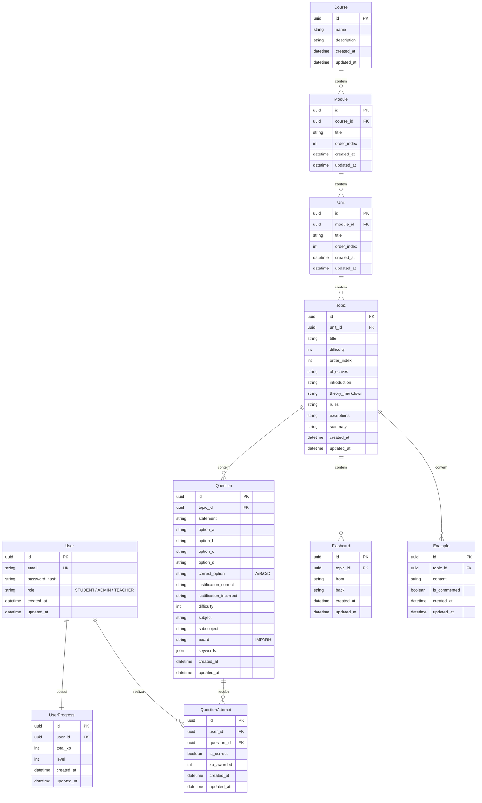

# Educador 🧠📚

O **Educador** é uma plataforma de aprendizagem digital e preparação inteligente voltada para concursos públicos, com foco inicial na banca **IMPARH**. O sistema oferece uma estrutura de cursos dividida em módulos, unidades e tópicos, com teoria em Markdown, exemplos práticos, flashcards para repetição espaçada, simulados (quizzes), acompanhamento de progresso gamificado (com XP e níveis) e um **Tutor de Inteligência Artificial** para explicação detalhada de erros.

---

## 🏗️ Arquitetura do Projeto

O projeto é estruturado como um monorepositório contendo três principais pilares:
1. **Banco de Dados**: Relacional (PostgreSQL), executado via Docker.
2. **Backend**: API RESTful construída com Python e FastAPI, utilizando padrões de Clean Architecture adaptados (Divisão entre Camada de API, Domínio/Schemas e Infraestrutura/Repositórios/Serviços).
3. **Frontend**: Aplicativo multiplataforma (Android, iOS, Web, Windows) desenvolvido em Flutter, utilizando Riverpod para gerência de estado e GoRouter para navegação.

```
Educador (Raiz)
├── backend/            # API FastAPI (Python)
├── frontend/           # App Mobile/Web (Flutter)
├── flutter/            # SDK do Flutter (embutido ou baixado no ambiente)
└── docker-compose.yml  # Configuração dos serviços do Docker (PostgreSQL)
```

---

## 🗄️ Modelagem do Banco de Dados (ERD)

Abaixo está a representação visual da modelagem do banco de dados relacional e seus relacionamentos utilizando Mermaid:



---

## 🖥️ Detalhamento do Backend (FastAPI)

O backend do Educador foi desenvolvido com foco em performance e concorrência usando o modelo assíncrono do FastAPI.

### Estrutura de Diretórios do Backend
```
backend/
├── alembic/                 # Migrações do Banco de Dados
│   └── versions/            # Arquivos de migração gerados automaticamente
├── app/
│   ├── api/                 # Rotas/Endpoints da API (Controladores)
│   │   ├── ai.py            # Endpoint de integração com o Tutor de IA
│   │   ├── courses.py       # Gerenciamento de Cursos
│   │   ├── progress.py      # Registro de progresso e estatísticas
│   │   └── ...              # Módulos, Unidades, Tópicos, Questões, Flashcards
│   ├── core/                # Configurações globais e segurança
│   │   └── config.py        # Configurações com Pydantic Settings (.env)
│   ├── domain/              # Modelagem de negócios e validação
│   │   └── schemas.py       # Modelos Pydantic (Request, Response, DTOs)
│   └── infrastructure/      # Acesso a dados e serviços externos
│       ├── db/
│       │   ├── models/      # Entidades SQLAlchemy (Tabelas do Banco)
│       │   ├── base.py      # Classe Base e Mixins (TimestampMixin)
│       │   └── session.py   # Configuração e Injeção de Sessão (Engine)
│       ├── repositories/    # Padrão Repository para persistência de dados
│       └── services/        # Regras de Negócio e Serviços Externos (AI Tutor)
├── requirements.txt         # Dependências do Python
└── seed_db.py               # Script para popular o banco de dados com dados iniciais
```

### Endpoints Principais (API v1)

| Tag | Método | Rota | Descrição |
| :--- | :---: | :--- | :--- |
| **Courses** | `POST` | `/api/v1/courses/` | Cria um novo curso |
| | `GET` | `/api/v1/courses/` | Lista todos os cursos cadastrados |
| | `GET` | `/api/v1/courses/{course_id}` | Obtém detalhes de um curso específico (com árvore completa) |
| **Progress** | `POST` | `/api/v1/progress/attempt` | Registra tentativa de questão de um aluno e atribui XP |
| | `GET` | `/api/v1/progress/summary` | Obtém o progresso geral do aluno logado (XP, Nível) |
| **AI Tutor** | `POST` | `/api/v1/ai/explain` | Requisita ao Tutor de IA uma explicação em Markdown sobre o erro de uma questão |

### Tutor de Inteligência Artificial (`ai_tutor.py`)
A integração de inteligência artificial é desacoplada através de injeção de dependência (`get_tutor_service`):
- **`MockTutorService`**: Usado por padrão no ambiente local para simular a resposta de um tutor inteligente e evitar custos desnecessários com a API.
- **`GeminiTutorService`**: Preparado para utilizar a API do Google Generative AI (`gemini-1.5-flash`) para responder dinamicamente com base no enunciado, alternativas, resposta do aluno e justificativa de acerto/erro da questão.

---

## 📱 Detalhamento do Frontend (Flutter)

O frontend foi planejado utilizando uma arquitetura orientada a **Features**, separando responsabilidades e facilitando a escalabilidade.

### Estrutura de Diretórios do Frontend
```
frontend/
├── lib/
│   ├── core/
│   │   └── network/         # Cliente HTTP customizado usando Dio (DioClient)
│   ├── features/
│   │   ├── admin/           # Telas administrativas para criação de conteúdo
│   │   ├── ai/              # Integração do tutor inteligente na tela de quiz
│   │   ├── auth/            # Telas de login e controlador de sessão
│   │   ├── course/          # Exibição do conteúdo, teoria, flashcards e quizzes
│   │   └── gamification/    # Dashboard, sistema de progresso e barra de navegação principal
│   └── main.dart            # Inicializador do App, rotas do GoRouter e Tema global
```

### Tecnologias e Bibliotecas Utilizadas
- **Gerência de Estado**: `flutter_riverpod` - Abordagem declarativa moderna com reatividade robusta para autenticação e dados do curso.
- **Roteamento**: `go_router` - Roteamento declarativo baseado em caminhos com suporte a redirecionamentos inteligentes para autenticação (se o usuário não estiver autenticado, é forçado a ir para `/login`).
- **Comunicação de Rede**: `dio` - Biblioteca HTTP robusta que facilita interceptores, controle de timeout e parsing automático de JSON.

---

## 🚀 Como Executar o Projeto Localmente

### Passo 1: Inicializar o Banco de Dados
Certifique-se de possuir o Docker instalado em sua máquina. Na raiz do projeto, execute:
```bash
docker-compose up -d
```
Isso iniciará um container PostgreSQL mapeado na porta local `5433` (com as credenciais padrões configuradas em `backend/app/core/config.py`).

### Passo 2: Configurar e Rodar o Backend
1. Navegue até a pasta do backend:
   ```bash
   cd backend
   ```
2. Crie e ative um ambiente virtual Python:
   - **Windows (PowerShell)**:
     ```powershell
     python -m venv venv
     .\venv\Scripts\Activate.ps1
     ```
   - **Linux/macOS**:
     ```bash
     python3 -m venv venv
     source venv/bin/activate
     ```
3. Instale as dependências:
   ```bash
   pip install -r requirements.txt
   ```
4. Aplique as migrações do banco de dados (Alembic):
   ```bash
   alembic upgrade head
   ```
5. Popule o banco de dados com a carga inicial de testes (Seed):
   ```bash
   python seed_db.py
   ```
6. Inicie o servidor FastAPI:
   ```bash
   uvicorn app.main:app --reload
   ```
   A API estará rodando em `http://127.0.0.1:8000`. Você pode visualizar a documentação interativa das rotas no Swagger em `http://127.0.0.1:8000/docs`.

### Passo 3: Configurar e Rodar o Frontend
1. Abra um novo terminal e navegue até a pasta do frontend:
   ```bash
   cd frontend
   ```
2. Baixe os pacotes do Flutter:
   ```bash
   flutter pub get
   ```
3. Execute o aplicativo:
   - Para rodar no navegador (Web):
     ```bash
     flutter run -d chrome
     ```
   - Para rodar em um emulador ou dispositivo físico conectado:
     ```bash
     flutter run
     ```

---

## 🏆 Gamificação e Fluxo de Aprendizado

1. **Dashboard Principal**: O aluno visualiza seu nível atual, XP acumulado e suas estatísticas de acerto/erro.
2. **Estudo Teórico**: O aluno acessa os Tópicos, estuda a teoria (renderizada a partir de Markdown) e vê os exemplos.
3. **Fixação**: Utiliza a aba de **Flashcards** para testar sua memória ativa com perguntas e respostas curtas.
4. **Prática (Simulados)**: Realiza o **Quiz** do tópico:
   - Cada acerto concede **10 XP** ao aluno.
   - Cada erro não concede XP, mas libera o botão **"Tutor de IA"** para que o aluno possa entender exatamente por que errou e qual era o raciocínio correto.
5. **Level Up**: A cada **100 XP** acumulados, o aluno avança para o próximo nível (Ex: Nível 1 -> 0 a 99 XP, Nível 2 -> 100 a 199 XP, etc.).
# Educador-IMPARH
